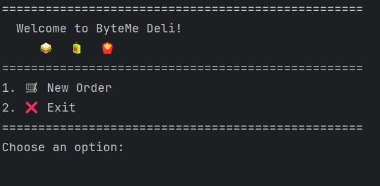
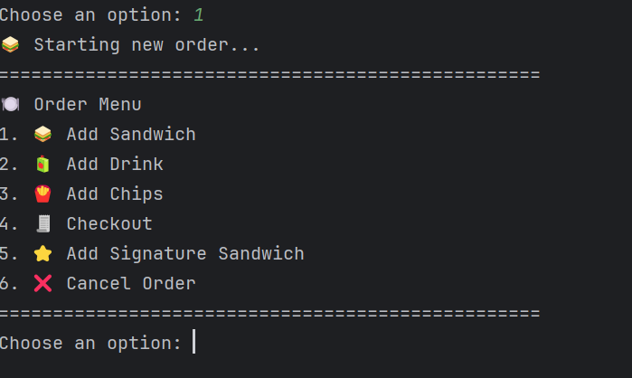
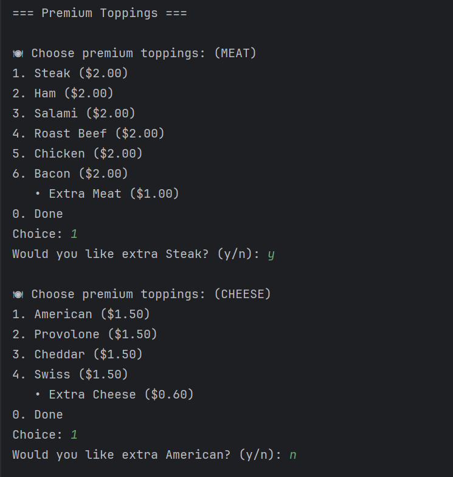
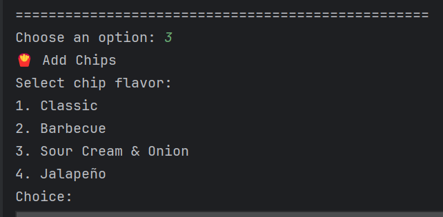
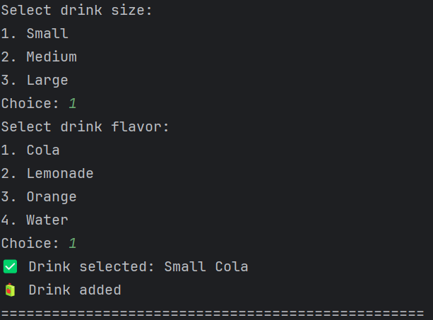
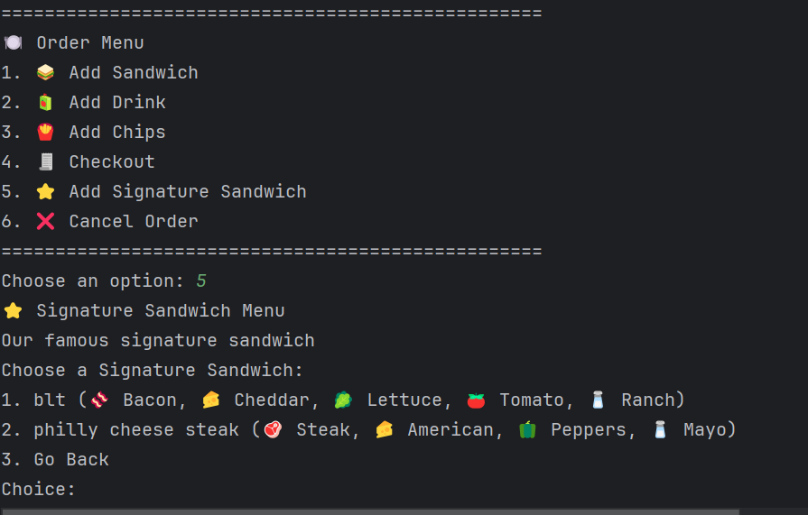
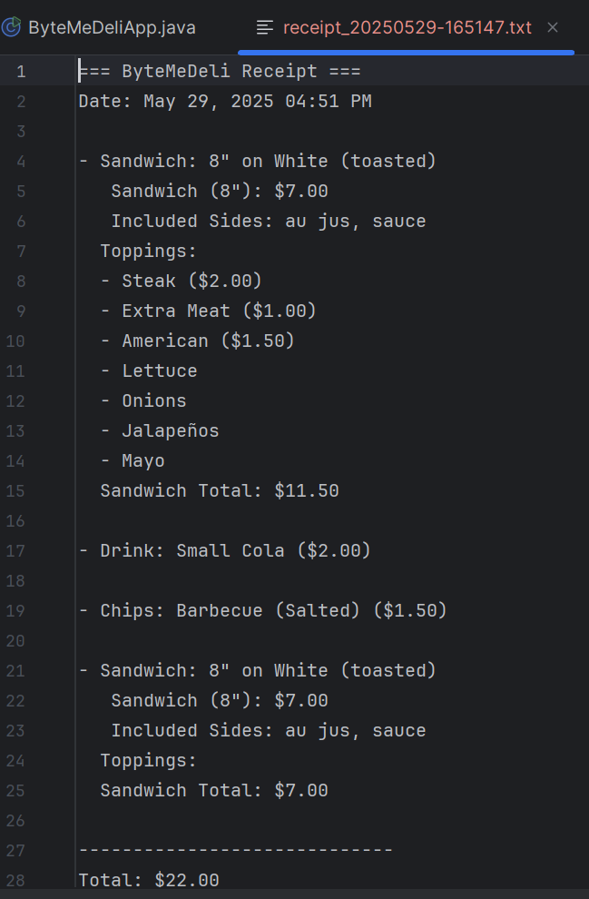

# ByteMeDeli 🥪
ByteMeDeli is a Java-based CLI application that simulates a point-of-sale (POS) system for a sandwich shop. Users can build their own sandwiches, choose signature combos, add drinks or chips, and check out with a detailed receipt.
---
## 📦 Features
+ Create custom sandwiches (size, bread, toast, toppings)
+ Choose signature sandwiches (e.g., BLT, Philly Cheese Steak)
+ Add premium and regular toppings (with extra option and pricing)
+ Select drinks by size
+ Choose chips (salted or unsalted)
+ View order summary and auto-generated receipt
+ Input validations and back-to-menu flow
+ Supports receipt file saving in `/resources/receipts`
+ Rich CLI experience with icons, prices, and color styling
---
## 🛠 Technologies Used
+ Java 17
+ OOP (Inheritance, Abstraction, Polymorphism)
+ Streams API
+ File I/O
+ Scanner input handling
+ Git & GitHub for version control
---
## 📸 Screenshots
### 🏠 Home Screen

### 🥖 Sandwich Builder

### 🧀 Premium Toppings

### 🍟 Chips & 🥤 Drinks
  

### ⭐ Signature Sandwiches

### 📋 Receipt

---
## 🧠 Design Notes
+ Uses a flexible data model (`Topping`, `Sandwich`, `Order`) for scalability.
+ `ToppingData` manages regular vs premium toppings, sizes, and extra pricing.
+ Follows clean code practices and single responsibility principle.
---
## 📁 Folder Structure
<pre>

```bash

src/

├── com.pluralsight

│   ├── data/

│   │   └── ToppingData.java

│   ├── models/

│   │   ├── Chips.java

│   │   ├── Drink.java

│   │   ├── Order.java

│   │   ├── OrderItem.java

│   │   ├── Sandwich.java

│   │   ├── SignatureSandwich.java

│   │   └── Topping.java

│   ├── ui/

│   │   ├── CheckoutScreen.java

│   │   ├── ChipsScreen.java

│   │   ├── DrinkScreen.java

│   │   ├── HomeScreen.java

│   │   ├── SandwichScreen.java

│   │   ├── SignatureSandwichScreen.java

│   │   └── UserInterface.java

│   └── util/

│       └── ReceiptWriter.java

│

├── ByteMeDeliApp.java

resources/

├── receipts/

└── screenshots/

    ├── home_screen.png

    ├── menu.png

    ├── premium_topping.png

    ├── select_drink.png

    ├── select_chips.png

    └── receipt.png

```
</pre>
 

## 🧪 Testing
Unit testing has been added to validate core functionality. Tests cover:
+ ✅ Sandwich price calculation (including regular, premium, and extra toppings)
+ ✅ Order total calculation using all item types (sandwich, drink, chips)
+ 🚧 Additional tests like empty order, summary output, and edge cases can be added
  
✅ How to Run
1. Clone the repo
2. Open in IntelliJ (or any IDE)
3. Run ByteMeDeliApp.java
4. Follow the CLI prompts to place your order

🧾 License
Created by Eyob Mengistu – 2025
